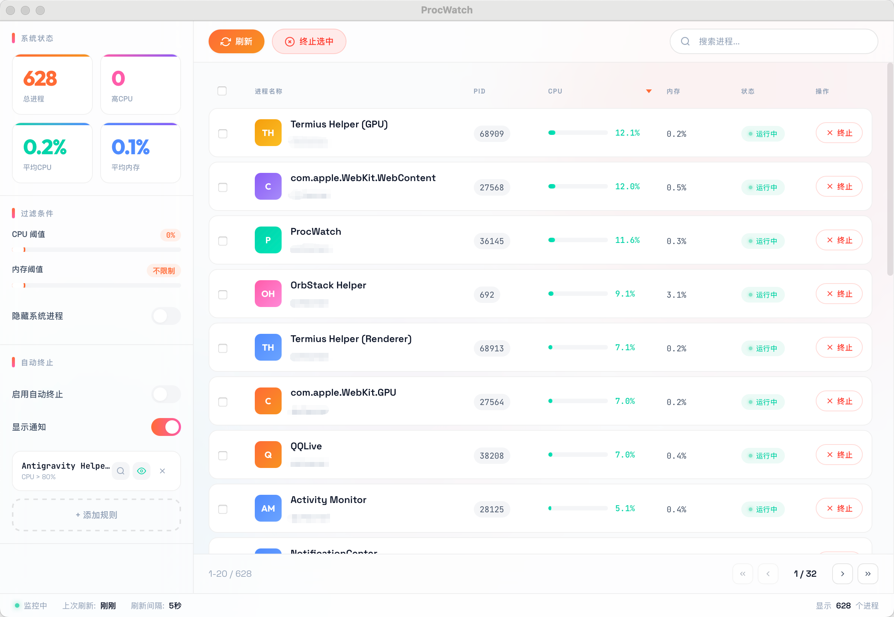

<p align="center">
  
</p>

<h1 align="center">ProcWatch</h1>

<p align="center">
  <strong>🔍 一款现代化的跨平台进程监控与管理工具</strong>
</p>

<p align="center">
  <a href="#功能特性">功能特性</a> •
  <a href="#截图预览">截图预览</a> •
  <a href="#安装">安装</a> •
  <a href="#使用指南">使用指南</a> •
  <a href="#开发">开发</a> •
  <a href="#技术栈">技术栈</a>
</p>

<p align="center">
  
  
  
</p>

---

## 📖 简介

**ProcWatch** 是一款使用 Go + Wails 构建的跨平台进程监控应用，提供直观的图形界面来查看、管理和自动终止系统进程。无论是开发者调试应用，还是普通用户管理系统资源，ProcWatch 都能提供便捷的解决方案。

### ✨ 核心亮点

- 🎨 **现代化 UI** - 精心设计的用户界面，支持实时数据展示
- ⚡ **高性能** - 基于 Go 语言，资源占用极低
- 🖥️ **跨平台** - 原生支持 macOS 和 Windows
- 🔄 **实时监控** - 5秒自动刷新，掌握系统动态
- 🎯 **智能规则** - 支持通配符匹配，灵活配置自动终止策略
- 💾 **规则持久化** - 自动保存配置，重启后自动加载

---

## 🚀 功能特性

### 📊 实时进程监控

- 显示进程 PID、名称、CPU、内存、状态、用户等信息
- 支持按 CPU、内存、PID、名称排序
- 分页显示，支持大量进程列表
- 实时计算 CPU 使用率（精确采样）

### 🔍 智能过滤与搜索

- CPU/内存阈值过滤
- 关键词搜索（进程名、PID、用户）
- 隐藏系统进程选项

### ⚙️ 自动终止规则

- 支持通配符 `*` 匹配进程名（如 `*chrome*` 匹配所有包含 chrome 的进程）
- 精确匹配模式
- CPU 和内存双阈值设置（任一超标即触发）
- 规则启用/禁用控制
- 规则测试功能（预览匹配结果）
- 规则持久化存储

### 🎯 进程管理

- 单进程终止
- 批量终止选中进程
- 确认对话框保护
- 进程详情面板

### 🔔 通知系统

- 操作结果通知
- 自动终止通知
- 可开关通知显示

---

## 📸 截图预览

> 主界面展示进程列表、系统状态统计、过滤条件

<p align="center">
  
</p>

> 自动终止规则配置

<p align="center">
  
</p>

---

## 💻 安装

### 从 Release 下载

前往 [Releases](https://github.com/NexusToolsLab/ProcWatch/releases) 页面下载对应平台的安装包：

- **macOS**: `ProcWatch-x.x.x.dmg` 或 `ProcWatch-x.x.x.zip`
- **Windows**: `ProcWatch-x.x.x-installer.exe`

### 从源码构建

#### 前置要求

- [Go](https://golang.org/dl/) 1.21 或更高版本
- [Node.js](https://nodejs.org/) 16 或更高版本
- [Wails](https://wails.io/docs/gettingstarted/installation) CLI

```bash
# 安装 Wails CLI
go install github.com/wailsapp/wails/v2/cmd/wails@latest

# 克隆项目
git clone https://github.com/NexusToolsLab/ProcWatch.git
cd ProcWatch

# 安装前端依赖
cd frontend && npm install && cd ..

# 开发模式运行
wails dev

# 构建生产版本
wails build
```

构建产物位于 `build/bin/` 目录。

---

## 📚 使用指南

### 基础操作

1. **查看进程** - 启动应用后自动加载进程列表
2. **搜索进程** - 在顶部搜索框输入关键词
3. **过滤进程** - 使用左侧滑块设置 CPU/内存阈值
4. **终止进程** - 点击进程行的「终止」按钮，或勾选后批量终止

### 自动终止规则

#### 添加规则

1. 点击左侧「+ 添加规则」按钮
2. 填写配置：
   - **进程名称**: 支持通配符，如 `*chrome*`、`node`、`*helper*`
   - **CPU 阈值**: CPU 使用率超过此值时触发（0 表示不限制）
   - **内存阈值**: 内存使用率超过此值时触发（0 表示不限制）
   - **精确匹配**: 勾选后进程名必须完全一致

#### 规则示例

| 进程名称 | CPU 阈值 | 内存阈值 | 精确匹配 | 说明 |
|---------|---------|---------|---------|------|
| `*chrome*` | 80% | 0% | 否 | 匹配所有 Chrome 相关进程 |
| `node` | 90% | 50% | 是 | 仅匹配名为 node 的进程 |
| `*helper*` | 0% | 0% | 否 | 匹配所有包含 helper 的进程，立即终止 |

#### 启用自动终止

1. 确保规则已启用（眼睛图标为亮色）
2. 打开「启用自动终止」开关
3. 系统每 5 秒检查一次，符合条件的进程将被自动终止

#### 测试规则

点击规则卡片上的 🔍 图标，可以预览当前规则能匹配到哪些进程。

### 规则持久化

规则自动保存在用户目录：
- **macOS**: `~/.procwatch_rules.json`
- **Windows**: `C:\Users\<用户名>\.procwatch_rules.json`

---

## 🛠️ 开发

### 项目结构

```
ProcWatch/
├── app.go                 # Go 后端逻辑
├── main.go               # 应用入口
├── wails.json            # Wails 配置
├── ProcWatch.png         # 应用图标
├── frontend/
│   ├── src/
│   │   ├── main.js       # 前端逻辑
│   │   └── style.css     # 样式文件
│   ├── index.html        # HTML 入口
│   └── wailsjs/          # Wails 自动生成的绑定
├── build/
│   ├── appicon.png       # 应用图标 (PNG)
│   ├── appicon.icns      # macOS 图标
│   ├── windows/
│   │   └── icon.ico      # Windows 图标
│   └── darwin/
│       └── Info.plist    # macOS 配置
└── docs/
    └── screenshots/      # 截图
```

### 开发命令

```bash
# 开发模式（热重载）
wails dev

# 生成绑定
wails generate module

# 构建 macOS 版本
wails build -platform darwin/amd64
wails build -platform darwin/arm64

# 构建 Windows 版本
wails build -platform windows/amd64

# 构建所有平台
wails build -platform darwin/amd64,darwin/arm64,windows/amd64
```

### 添加新功能

1. 在 `app.go` 中添加 Go 方法
2. 运行 `wails dev` 自动生成 JS 绑定
3. 在 `frontend/src/main.js` 中调用新方法

---

## 🔧 技术栈

### 后端

- **[Go](https://golang.org/)** - 高性能系统编程语言
- **[Wails v2](https://wails.io/)** - Go 语言桌面应用框架
- **[gopsutil](https://github.com/shirou/gopsutil)** - 跨平台进程监控库

### 前端

- **原生 JavaScript** - 无框架，轻量高效
- **Vite** - 快速前端构建工具
- **CSS3** - 现代化样式，毛玻璃效果

### 特性

- 响应式设计，适配不同屏幕尺寸
- 原生窗口，无需内嵌浏览器
- 跨平台支持（macOS、Windows）

---

## 🤝 贡献

欢迎提交 Issue 和 Pull Request！

1. Fork 本仓库
2. 创建特性分支 (`git checkout -b feature/AmazingFeature`)
3. 提交更改 (`git commit -m 'Add some AmazingFeature'`)
4. 推送到分支 (`git push origin feature/AmazingFeature`)
5. 提交 Pull Request

---

## 📝 更新日志

### v1.1.1 (2026-03-17)

- 🐛 修复检查更新时 GitHub API 返回 403 错误的问题（添加 User-Agent 请求头）
- 🔧 项目迁移至 [NexusToolsLab/ProcWatch](https://github.com/NexusToolsLab/ProcWatch)

### v1.1.0 (2026-03-16)

- ✨ 初始版本发布
- ✅ 进程实时监控
- ✅ 自动终止规则
- ✅ 规则持久化
- ✅ 跨平台支持

---

## 📄 许可证

本项目基于 [MIT](LICENSE) 许可证开源。

---

## 🙏 致谢

- [Wails](https://wails.io/) - 优秀的 Go 桌面应用框架
- [gopsutil](https://github.com/shirou/gopsutil) - 强大的跨平台系统监控库
- [Space Grotesk](https://fonts.google.com/specimen/Space+Grotesk) - 美观的字体

---

<p align="center">
  Made with ❤️ by <a href="https://github.com/NexusToolsLab">NexusToolsLab</a>
</p>